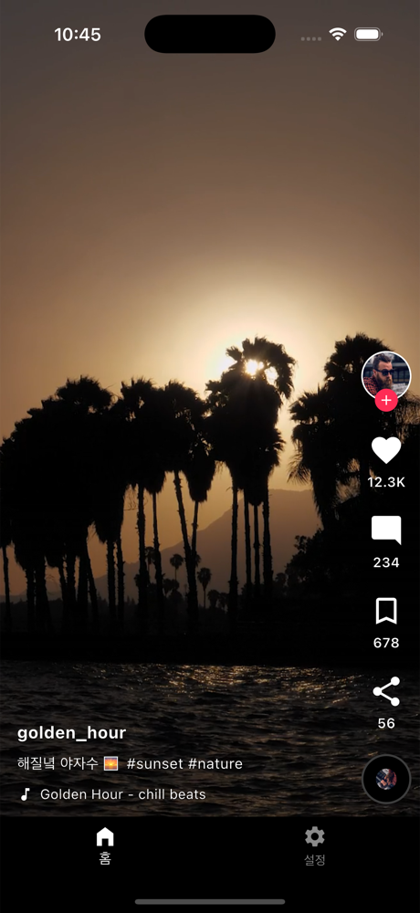
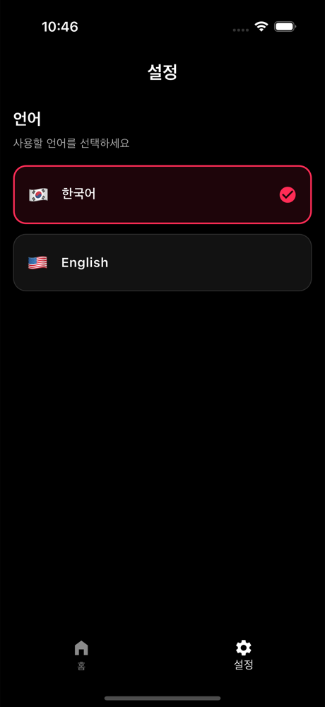

# TikTok Clone (Flutter)

슈퍼센트 **AI 네이티브 직무** 과제 — Flutter로 구현한 TikTok 스타일 숏폼 영상 피드 앱.

세로 `PageView` 피드, 현재 영상 자동재생 / 화면 밖 자동 일시정지, 영상 위 오버레이 UI(좋아요·댓글·북마크·공유, username·caption·음악)를 갖추고, 가산점 항목(좋아요 토글·더블탭 좋아요·무한 스크롤·Riverpod 상태관리·확장형 구조)을 모두 포함합니다. 추가로 바텀 탭(홈/설정) + 한/영 언어 전환, 영상 디스크 캐시, 로딩 포스터를 구현했습니다.

<p align="center">
  
  &nbsp;&nbsp;
  
</p>

## 데모 영상

▶️ _(여기에 1~2분 실행 영상 링크 추가 — vertical scroll / video playback / UI interaction 확인용)_

---

## 실행 방법

**요구사항**

- Flutter `3.44+` / Dart `3.12+`
- iOS 시뮬레이터(권장: iPhone 16 Pro) 또는 Android 에뮬레이터 / 실기기
- (iOS) Xcode + CocoaPods

**실행**

```bash
flutter pub get
flutter run                # 기기 여러 개면 flutter run -d <device-id>
```

> 생성 코드(freezed / json_serializable / l10n)는 저장소에 포함되어 있어 바로 실행됩니다.
> 모델·다국어 문자열을 수정했다면 다시 생성하세요: `dart run build_runner build`

**검증**

```bash
flutter analyze            # 정적 분석 (경고 0)
flutter test               # 단위 테스트 (16개)
```

> iOS는 `Info.plist`에 ATS 예외가 설정되어 있고, 화면은 세로 모드로 고정됩니다. 영상은 공개·로열티프리 H.264 MP4(mixkit) URL을 사용합니다.

---

## 사용한 패키지

| 패키지                | 용도                                                 |
| --------------------- | ---------------------------------------------------- |
| `flutter_riverpod`    | 상태관리 (Notifier / AsyncNotifier, DI)              |
| `video_player`        | 영상 재생 (공식 플러그인)                            |
| `flutter_cache_manager` | 영상 파일 디스크 캐시 (재방문 시 즉시 재생)        |
| `cached_network_image` | 아바타·썸네일 이미지 캐싱                            |
| `go_router`           | 선언형 라우팅 + 바텀 탭(StatefulShellRoute)          |
| `flutter_localizations` + `intl` | 다국어(i18n) — gen-l10n(ARB) 기반          |
| `shared_preferences`  | 선택 언어 영속화                                     |
| `freezed` + `json_serializable` | 데이터 모델 코드 생성(불변/copyWith/fromJson) |

dev: `build_runner`, `flutter_lints`

---

## 프로젝트 구조

기능 단위로 나눈 **feature-first** 구조입니다. 횡단 관심사는 `core/`, 데이터 계층은 `data/`, 화면 기능은 `features/<feature>/`로 분리했습니다.

```
lib/
├─ main.dart                      # ProviderScope + SharedPreferences 주입 + 시스템 UI
├─ app.dart                       # MaterialApp.router + 다크 테마 + locale/l10n
├─ core/
│  ├─ constants/                  # preloadWindow, pageSize 등 튜닝 상수
│  ├─ preferences/                # sharedPreferencesProvider
│  ├─ router/                     # go_router(app_router) + 바텀 탭 셸(scaffold_with_nav_bar)
│  ├─ theme/                      # DESIGN.md 토큰 구현 (색/타이포/스페이싱)
│  └─ utils/                      # number_format (1.2K / 3.4M)
├─ data/
│  ├─ models/                     # VideoModel (freezed + json_serializable)
│  └─ repositories/               # VideoRepository (assets/mock/videos.json 로드 + 페이지네이션)
├─ features/
│  ├─ feed/
│  │  ├─ providers/               # feed_provider(목록·무한스크롤·좋아요/북마크)
│  │  │                           # video_manager(★ 컨트롤러 풀 — 핵심)
│  │  ├─ screens/                 # feed_screen (PageView 세로 + lifecycle + loadMore)
│  │  └─ widgets/                 # player / overlay / 액션바 / 하단정보 / 더블탭 하트 등
│  └─ settings/                   # locale_provider + settings_screen(언어 선택 UI)
└─ l10n/                          # app_en.arb / app_ko.arb (+ 생성된 gen/)
assets/mock/videos.json           # mock 피드 데이터
```

설계 문서: [`DESIGN.md`](DESIGN.md)(디자인 시스템) · [`DEVLOG.md`](DEVLOG.md)(의사결정 로그) · [`CLAUDE.md`](CLAUDE.md)(코드베이스 가이드).

---

## 구현 기능 목록

**필수**

- ✅ 세로 스크롤 영상 피드 (`PageView.builder`, `Axis.vertical`)
- ✅ 현재 화면 영상 자동재생 / 화면 밖 영상 자동 일시정지
- ✅ `video_player` 기반 재생: autoplay · 탭 pause/resume · buffering 스피너
- ✅ 오버레이 UI — 우측: ❤️ Like · 💬 Comment · 🔖 Bookmark · ↗ Share / 하단: username · caption · ♪ 음악

**가산점 (전체 구현)**

- ✅ 좋아요 토글 (스케일 팝 애니메이션)
- ✅ 더블탭 좋아요 (탭 위치 하트 버스트, 좋아요만/취소 없음)
- ✅ 무한 스크롤 (끝 근접 시 다음 페이지 로드)
- ✅ 상태관리 — Riverpod
- ✅ 확장 가능한 feature-first 구조
- ✅ 단위 테스트 (number_format · 좋아요/북마크 로직 · feed provider)

**추가 구현**

- 바텀 탭바(홈/설정) — go_router `StatefulShellRoute`(탭 상태 보존), 탭 이탈 시 영상 일시정지
- 한국어/English 언어 전환 + `shared_preferences` 영속화
- 영상 디스크 캐시(`flutter_cache_manager`) — 재방문 즉시 재생 + 트래픽 절감
- 썸네일 로딩 포스터 — 다운로드 중 정지컷 표시로 지연 체감 완화
- 앱 백그라운드/복귀 시 일시정지·재개, 영상 로드 실패 시 재시도 UI

---

## Q1. 앱 구조 설계

**폴더 구조 (feature-first)**
기능 단위 응집을 우선했습니다. `core`(테마·상수·라우터·유틸), `data`(모델·리포지토리), `features/feed`·`features/settings`로 나눠 새 기능은 `features/<new>`만 추가하면 되고 데이터·UI가 섞이지 않습니다. 데이터 계층은 순수 Dart라 위젯 없이 테스트할 수 있습니다.

**상태관리 선택 (Riverpod)**

- 컴파일 타임 안전성과 `ref` 기반 의존성 주입 — 리포지토리를 가짜로 교체해 위젯 없이 로직을 테스트(`feed_provider_test`)합니다.
- 비동기 피드 로딩·무한 스크롤을 `AsyncNotifier`의 `AsyncValue`(로딩/에러/데이터)로 자연스럽게 표현합니다.
- 네이티브 리소스를 쥔 `VideoManager`는 `Provider` + `ref.onDispose`로 생성·정리해 생명주기를 명확히 합니다.
- "코드젠은 보일러플레이트가 큰 데이터 모델에만" 원칙으로, 모델만 freezed/json 코드젠을 쓰고 provider는 plain Notifier를 유지했습니다.

**Video player lifecycle 처리**
`VideoManager`가 현재 index **± 1**만 컨트롤러를 유지하는 **슬라이딩 윈도우 풀**을 운영합니다. 데이터·오케스트레이션은 Riverpod이, 프레임 단위 값(`isBuffering`/`isPlaying`)은 컨트롤러 자체의 `ValueListenable`을 위젯에서 직접 구독해 불필요한 rebuild를 막습니다. 윈도우를 벗어난 컨트롤러는 즉시 `pause + dispose`하고, 재생은 `play()` 직전 현재 index를 재검증한 뒤 수행합니다. 앱 백그라운드(`AppLifecycleListener`)·탭 이탈 시 재생을 멈춥니다.

---

## Q2. 확장성 설계 (실제 TikTok 규모라면)

**Video preload 전략**

- 고정 ±1 윈도우 → 네트워크/스크롤 속도 기반 **적응형 윈도우**.
- 썸네일·첫 프레임 프리페치, 다음 영상 일부 프리버퍼.
- HLS/DASH **ABR**로 대역폭에 따라 해상도 적응, 컨트롤러 풀 **상한 + LRU** 회수.
- 현재는 `getSingleFile`(전체 다운로드 후 재생)이라 첫 시청 지연이 있음 → **스트리밍 캐시 프록시**(받으면서 재생)로 전환해 "재방문 즉시 + 첫 시청 스트리밍 시작" 둘 다 확보.

**네트워크 처리**

- mock(asset) → cursor 기반 페이지네이션 API + **CDN**.
- HTTP 캐싱(ETag), **재시도 + 지수 백오프**, 오프라인/디스크 캐시, 동시 요청 제한.

**상태관리 구조**

- 기능별 모듈화, `Repository` 인터페이스화 + DI로 데이터 소스 교체/모킹.
- 코드 규모가 커지면 `riverpod_generator` 코드젠 도입, 페이지네이션 상태(hasMore/loading/error)를 명시 모델로.

**성능 최적화**

- `const`·`RepaintBoundary`로 rebuild·repaint 격리, 이미지 캐시 용량 제한.
- 살아있는 디코더 수 상한, `ValueListenable` 직접 구독으로 위젯 rebuild 최소화.
- DevTools로 프레임/메모리 프로파일링, 영상 디코더 재사용.

---

## Q3. 가장 어려웠던 문제 — 한정된 비디오 컨트롤러의 생명주기

**문제 상황**
`VideoPlayerController`는 네이티브 디코더/메모리를 점유하는 한정 자원이라 영상마다 하나씩 만들면 금방 고갈돼 끊김·크래시가 납니다. 그래서 현재±1만 살리는 슬라이딩 윈도우 풀을 만들었는데, 초기화가 **비동기**라 두 가지 문제에 실제로 부딪혔습니다.

1. 빠르게 세로 스와이프하면 초기화가 끝나기 전에 현재 index가 바뀌어 **이미 지나간 영상이 뒤늦게 재생**되거나, 초기화 중이던 화면 밖 컨트롤러가 정리되지 않고 **리소스가 누수**됨.
2. 이웃을 미리 로드(프리로드)하기 시작하자, 스와이프로 그 영상에 도착했을 때 **정지 상태로 시작**하는 버그가 나타남.

**시도한 방법**

- 자원: ① 전부 생성 → 크래시, ② 페이지마다 컨트롤러 1개만 재사용 → 스와이프마다 재버퍼링으로 UX 저하.
- 버그 2 디버깅: 재생 로직이 컨트롤러 **"생성(`_ensure`)" 경로 안**에 있었는데, 이미 프리로드된 컨트롤러는 그 경로를 일찍 빠져나가(캐시 히트) `play()`가 호출되지 않았음. 매번 새로 만들어지는 첫 영상만 우연히 재생됐던 것.

**최종 해결**
슬라이딩 윈도우 풀에 가드를 두고 책임을 분리했습니다.

- `initialize()` 완료 후 **`index == currentIndex` 재검증** 후에만 `play()` (오재생 방지).
- 초기화 도중 윈도우를 벗어났으면 완료 즉시 **`dispose`** (누수 방지).
- **"준비(`_ensure`)"와 "활성 재생(`_playActive`)"의 책임을 분리** → 새로 만들었든 프리로드됐든 활성 영상은 항상 재생.

> 추가로, 검증 중 발견한 *간헐적 시작 정지* 버그(시작 중 transient `inactive` 상태에 과도하게 일시정지가 걸리던 문제)도 lifecycle 처리를 `paused`/`hidden`에서만 멈추도록 고쳐 해결했습니다. 상세 맥락은 [`DEVLOG.md`](DEVLOG.md) 참고.

---

## AI 사용 내역 및 대화 기록

- **AI 사용 여부:** 사용함 — **Claude Code (Opus)** 를 페어 프로그래밍 에이전트로 사용.
- **AI를 사용한 작업 범위:** 과제 요구사항 분석, 아키텍처·컨트롤러 생명주기 설계, 전체 코드 구현, 단위 테스트 작성, 공개 영상 URL 검증, 시뮬레이터 스크린샷 검증, 문서(README/DESIGN/DEVLOG/CLAUDE) 작성.
- **본인이 직접 작성/결정한 부분:** 핵심 기술 의사결정(상태관리 = Riverpod, 비디오 라이브러리 = video_player, 데모 타깃 = iOS 시뮬레이터, i18n = 공식 gen-l10n, 코드젠 범위 = 모델 한정 등), 코드 리뷰 및 방향 조정, UI 디테일 피드백(플레이 아이콘/로딩 위치 등), 시뮬레이터 동작 검증, 데모 영상 촬영.
- **가장 어려웠던 문제와 해결:** 위 **Q3** 참고.
- **대화 기록:** 의미 있는 의사결정은 [`DEVLOG.md`](DEVLOG.md)에 `맥락→대안→결정→이유` 형식으로 정리했습니다. 전체 AI 대화 트랜스크립트(Claude Code 세션)는 _(링크/스크린샷 첨부)_.

> 위 "본인이 직접 작성/결정한 부분"은 실제 작업에 맞게 검토·수정해 주세요.

---

## 데이터 출처

영상: [mixkit](https://mixkit.co/) (공개·로열티프리) · 아바타: [pravatar](https://pravatar.cc/) · 썸네일: [picsum](https://picsum.photos/). 평가 목적의 mock 데이터입니다.
